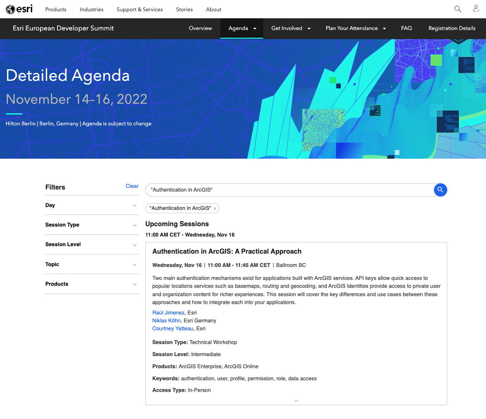

# arcgis-oauth-callback

This repo is just to demo how to authenticate in ArcGIS using an "[ArcGIS identity](https://developers.arcgis.com/documentation/mapping-apis-and-services/security/arcgis-identity/)" workflow. 

Check the [Postman collection here](https://www.postman.com/esridevs/workspace/authentication-in-arcgis/overview)

